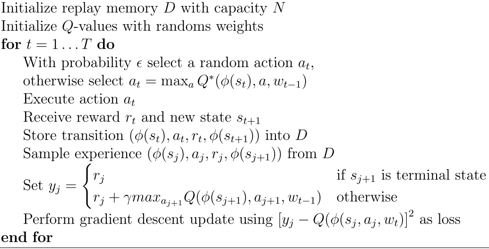
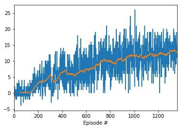

# Project 1: Navigation

### Introduction

This is the report of Udacity Deep Reinforcement Learning Nanodegree](https://www.udacity.com/course/deep-reinforcement-learning-nanodegree--nd893)   Navigation project. 

For the environment we use the [Unity ML Agents](https://github.com/Unity-Technologies/ml-agents) Banana environment.

The main idea is to approximate the Q function using a neural network.

## The environment

The Banana environment is a 3D "box" with randomly distributed bananas.  These bananas are either yellow or blue, and the agent's goal is to collect as many as the yellow ones while avoiding the blues. It receives reward of +1 is when collecting a yellow banana, and a reward of -1 for collecting a blue banana.

The table below depicts the environment:

### Reward

| event         | reward  |
|---------------|:-------:|
| yellow banana |   +1    |
| blue banana   |   -1    |

### State space

37 dimensional; velocity + rays for sensing.

### Actions

| index   | action        |
|---------|---------------|
| 0       | move forward  |
| 1       | move backward |
| 2       | turn left     |
| 3       | turn right    |

### Solution

Mean score +13 over 100 consequtive episodes.

## Network architecture

In the config file you see the network spec that was used to generate the network.

    network:
      input_dim: 37
      hidden_1_size: 32
      activation_1: relu
      hidden_2_size: 8
      activation_2: relu
      output_dim: 4

The architecture is composed by two hidden layers, eacg followed by a rectified linear activation.  The input dimension is 37
corresponding to the input from the Unity environment and the output dimension coresponds to the number of actions.

## Agent

The agent class is in `agent.py`, wich mediates the interaction between the environment and the model.  

As we are using experience replay. We have a buffer to store te past episodes and rewards. The parameters for agent are:

| param        | vaule    | description 
|--------------|----------|--------------------------------------
|BUFFER_SIZE   | int(1e5) | replay buffer size
|BATCH_SIZE    | 64       | minibatch size
|GAMMA         | 0.99     | discount factor
|TAU           | 1e-3     | for soft update of target parameters
|LR            | 5e-4     | learning rate 
|UPDATE_EVERY  | 4        | how often to update the network

## Training

The trainins steps of Deep Q-Learning Algorithm follows two steps, Sampling and Learning.
On sampling step, the algorithm chooses an action A from a state s using a policy, observes the reward and next state and stores it on a buffer memory. On learning step we use this buffer to select samples of past episodes to compute its expected Q-values.

After a UPDATE_EVERY steps, the network used to act (N1) is updated with the weights of the network used to compute the expected values (N2). it worths to not that N2 is learning during every step, but N1 is update only after UPDATE_EVERY step, in order to avoid high variance.

## Results 

The following graph shows the results of the training run.  Every dot in the graph represents the score of an
episode (drawn above the index of the episode). The orange dots are the rolling mean.

The problem was really solved at after episode 1357.

The weights learned during this run are saved in the file trained_model-fully_trained.pth.

## Future Works

For future work we could try changing the optimizers, using RMSProp os momentum SGD in place of Adam and check the effect of the learning rate, also change parameters like tau.
We may also try another aschitectures, like Dueling DQN and use Prioritized Experience Replay.